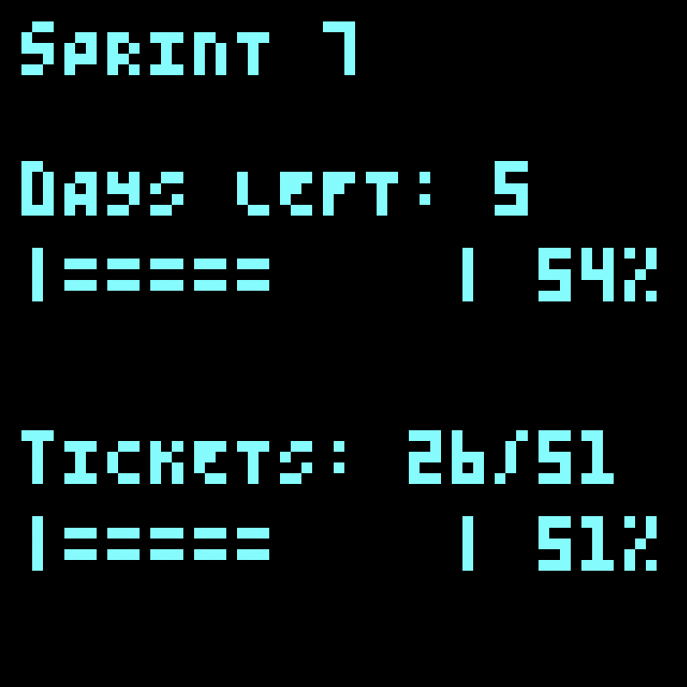

# Pixel KPI

<p align="center">
  
</p>

Create beautiful pixel-art dashboards for your KPIs! Connect to Notion, GitHub, or PyPi and display your data on Pixoo devices or other displays.


## Features
- 🎨 Pixel-art style components (text, charts, progress bars, etc.)
- 🔌 Connect to multiple data sources:
    - GitHub stars statistics
    - Notion sprint progress
    - PyPi download counts
    - ... (more to come)
- 📺 Multiple display options:
    - Divoom Pixoo devices
    - Terminal output
    - Matplotlib visualization
    - ... (more to come)

## Quick Start

1. Install the package:

```bash
pip install pixel_kpi
```

2. Create a simple PyPi Download dashboard:

```python
from pixel_kpi.displays.matplotlib_display import MatplotlibDisplay
from pixel_kpi.connectors.pypi_connector import PyPiConnector
from pixel_kpi.views.package_download_view import PackageDownloadView

# Create display
display = MatplotlibDisplay(
    display_name="MatplotlibDisplay",
    display_id=0,
    width=64,
    height=64
)

# Set up PyPi connector
pypi_connector = PyPiConnector()

# Create and run view 
view = PackageDownloadView(display=display, connector=pypi_connector, processor=None, refresh_rate=60*15, main_color=(80, 255, 255), package_name=args.package_name)
view.run()
```

## Examples

Check out the example scripts in the `examples` folder:
- `github_star_stats.py` - Display GitHub repository stars
- `notion_sprint.py` - Show Notion sprint progress
- `pypi_downloads.py` - Track PyPi package downloads
- `notion_github_rotate.py` - Rotate between multiple views

Example usage:

```bash
python examples/github_star_stats.py \
  --display_type matplot \
  --github_api_key "xxx" \
  --github_repo "owner/repo"
```

```bash
python examples/notion_sprint.py \
  --display_type terminal \
  --notion_api_key "your_notion_api_key" \
  --notion_database_id "your_database_id" \
  --refresh_rate 900 
```

## Learn More
Browse the Jupyter notebooks in `notebooks` to:
- See component examples and usage
- Learn how to create custom views
- Explore different display options
- Understand the data pipeline

## Contributing

### Setup
Here's how to get started:

1. Fork & clone
2. Setup dev environment:
```bash
poetry install
```
3. Create feature branch:
```bash
git checkout -b feature/name
```

### Structure

Here is the project structure:

```plaintext

📦 pixel_kpi
 ┣ 📂 pixel_kpi/      # Core package
 ┃ ┣ 📂 components/   # UI elements
 ┃ ┣ 📂 connectors/   # Data sources
 ┃ ┣ 📂 displays/     # Output targets
 ┃ ┣ 📂 processors/   # Data transforms
 ┃ ┗ 📂 views/        # Dashboards
 ┣ 📂 examples/       # Sample scripts
 ┗ 📂 notebooks/      # Tutorials
```

### Core Concepts

- **Components**: Pixel-art UI elements (text, charts, progress bars, etc.)
- **Connectors**: Data sources (GitHub, Notion, PyPi, etc.)
- **Displays**: Output targets (Pixoo, terminal, Matplotlib, etc.)
- **Processors**: Data transforms (aggregations, filters, etc.)
- **Views**: Dashboards that combine components, connectors, displays, and processors

## License

This work is licensed under a
[Creative Commons Attribution-NonCommercial-ShareAlike 4.0 International License][cc-by-nc-sa].

[![CC BY-NC-SA 4.0][cc-by-nc-sa-image]][cc-by-nc-sa]

[cc-by-nc-sa]: http://creativecommons.org/licenses/by-nc-sa/4.0/

[cc-by-nc-sa-image]: https://licensebuttons.net/l/by-nc-sa/4.0/88x31.png

[cc-by-nc-sa-shield]: https://img.shields.io/badge/License-CC%20BY--NC--SA%204.0-lightgrey.svg
